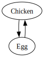

# dep-sys-rs




A command-line tool to detect circular dependencies from a Graphviz digraph
and perform topological sorting.

## Quick Start

To detect depdencies:

```console
$ cargo run -- check chicken.dot
Circular dependency detected between Chicken and Egg
```

To sort a graph:

```console
$ cargo run -- sort abc.dot
C
B
A
```
